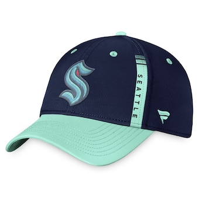
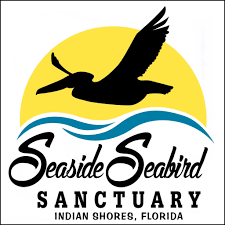
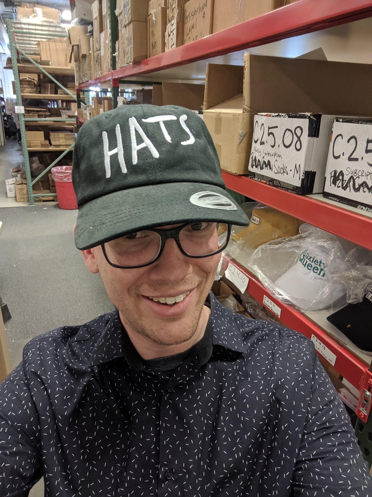
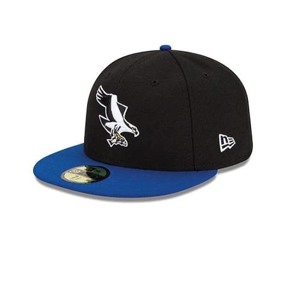
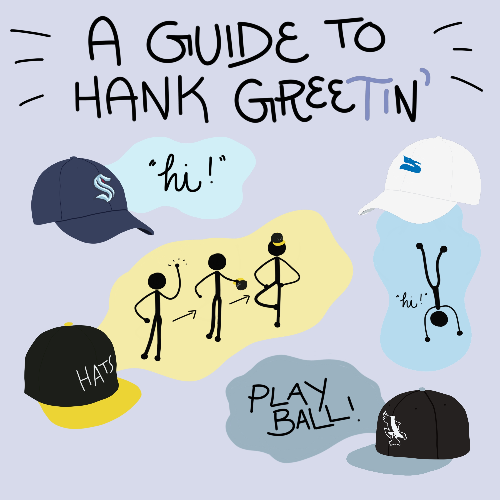

Hank Greens Hats!
=================

Seattle Kraken
---------------

If Hank is Wearing a **Seattle Krakens** hat then it is all good to come up and say hi!

Sun Coast Sea Bird Sanctuary Hat
--------------------------------

If hank is wearing his **Sun Coast Sea Bird Sanctuary Hat** you can come up and say hi... **BUT** only if you do something exceptional first such as...
#. Doing a Handstand or...
#. Jumping over your own leg

Hats Hat
--------

If Hank is wearing his **hats** hat (like cats (the musical) but instead of cats it says hats) then you need to do a little wave (A little wave like 1 2 3 4 5 really quickly (that's the whole wave)) but then you need to duck down and put on your **own** hats hat (like cats (the musical) but instead of cats it says hats) and you can do a pirouette but if you can't then that's fine.
`Buy a hats hat here (just in case) <https://store.dftba.com/products/dumb-hat>`_

Missoula Osprey Hat
-------------------

If Hank is wearing his **Missoula Osprey Hat** then you can come up to him but instead of saying hi you need to yell **PLAY BALL!**

Handy Chart
-----------
Here is a real handy chart.
`Made By @andincorporated <https://twitter.com/andincorporated/status/1562227092141531145>`_

